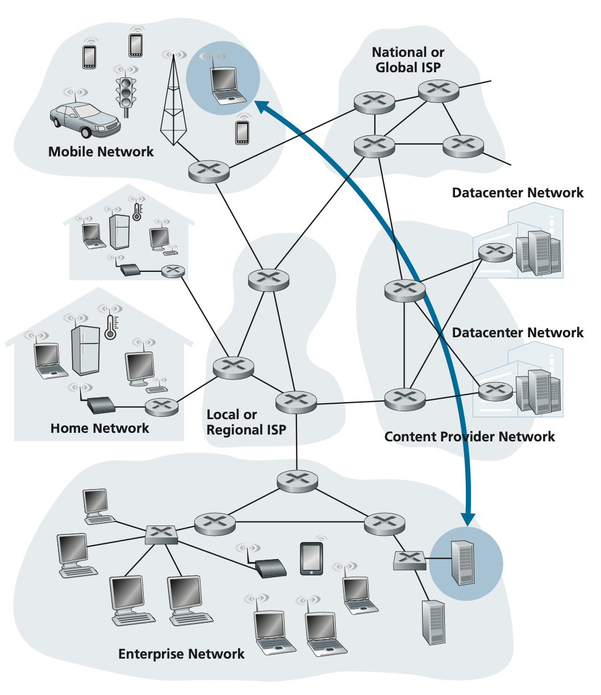

# 컴퓨터 네트워크

# Chapter 1. 컴퓨터 네트워크와 인터넷 (Computer Networks and the Internet)

- 컴퓨터 네트워킹과 인터넷의 개요
    - 기본 용어/개념 (1.1)
        - 네트워크를 구성하는 기본 하드웨어/소프트웨어의 구성요소
    - edge
        - end system과 application
    - core
        - access network, 물리 매체, 링크/스위치
    - 네트워크 간의 연결
    - 데이터 전송 지연과 손실 원인
    - 지연에 대한 간단한 양적 모델(전송, 전파, 큐잉 지연을 고려)
    - 프로토콜 계층구조와 서비스 모델
    - 네트워크 공격
    - 네트워킹의 역사

## 1. 인터넷이란 무엇인가? (What is the Internet?)

### 구성요소로 본 인터넷

- 인터넷
    
    : 전 세계적으로 수십억 개의 컴퓨팅 장치를 연결하는 컴퓨터 네트워크 (billions of connected computing devices)
    
    network of networks
    
    interconnected ISPs (Internet Service Provider)
    
    - ISP : packet switch + communication link, 와이파이, 셀룰러데이터, 모뎀 접속
- device = host / end system (ES)
    
    : end system - communication link + packet switch 의 네트워크로 연결됨
    
    internet edge에서 네트워크 앱을 실행
    
- link
    
    : a physical medium(물리 매체) used to connect two or more nodes **directly**
    
    물리 매체의 예 - fiber, copper, radio, satellite, optical
    
    transmission rate (전송률, bandwidth 대역폭)을 이용하여 데이터 전송 → bps 단위 사용
    
    데이터를 segment로 나누고 header를 붙임; **packet**
    
- packet switches
    
    : 도착하는 packet을 받아 출력 통신 링크로 전달(forward)
    
    **router** : network core와 **link-layer switch** : access network가 가장 많이 사용됨
    
    - route / path - 도달하는 동안 거쳐온 communication link와 packet switch
- networks
    
    : collection of devices, routers, links; managed by an organization
    
- protocol
    
    : end system, packet switch 등에 의해 수행됨, 정보 송수신을 제어
    
    control sending, receiving of messages, 패킷 포맷 기술
    
    ex) HTTP, video streaming, skype, TCP, IP, WiFi, 4G, Ethernet
    
    인터넷 프로토콜 - **TCP (Transmission Control Protocol), IP (Internet Protocol)**
    
- Internet standards
    
    : IETF (Internet Engineering Task Force)에서 RFC(requests for comments) 개발
    

### 서비스 측면에서 본 인터넷

- 인터넷
    
    : end system에서 수행되는 application(distributed application)에 서비스를 제공하는 인프라 구조
    
    ex) web, streaming video, multimedia teleconferencing, email, games, e-commerce, social media, inter-connected appliances
    
    end system은 **socket interface(API)**를 제공함
    
    - sending program이 따라야 하는 규칙의 집합
    - 인터넷은 이 규칙에 따라 여러 서비스를 applications에 제공함

### 프로토콜이란 무엇인가?

- protocol
    
    : the **set of rules** and procedures to which the information exchange **between two or more entities should adhere**
    
    둘 이상의 통신 개체(entity) 간에 교환되는
    
    - the format of messages
    - the order of messages exchanged
    - the actions taken on the transmission and/or receipt of a message or other event - 메시지의 송수신과 다른 이벤트에 따른 행동
    
    을 정의
    

## 2. 네트워크의 가장자리 (The Network Edge)

### End-system

: 컴퓨터, 스마트폰, 서버, 다른 장치

웹 브라우저, 웹 서버, email 등의 기능 때문에 호스트라고도 부름

호스트 = 클라이언트와 서버로 구분됨

서버는 주로 데이터 센터 내에 위치

### Access Network

: End-to-end의 경로상에 있는 core의 **첫 라우터(edge router)**에 연결하는 네트워크 (communication links)

가정(residential), 기업(institutional - school, company), 모바일 환경(,pmobile - WIFI, 4G/5G)에서 사용됨

transmission rate, shared or dedicated access에 대한 관리

- 가정 접속
    - Cable-based access
        
        
        
        - HFC (Hybrid Fiber Coax)
            
            : 케이블 TV 서비스 회사로부터 서비스를 받아, **광케이블**을 통해 neighborhood-level junction에 cable headend를 연결하고, **동축케이블**을 통해 각 가정에 연결됨 (FDM) ⇒ Hybrid
            
            analog를 digital로 변환하고 2개의 채널로 나누는 케이블 모뎀(CMTS)이 필요
            
            asymmetric - downstream이 더 빠름
            
            **shared** broadcast medium - 실제 수신율이 사용자에 따라 달라지고 충돌이 날 수도 있음
            
    - Digital Subscriber Line (DSL)
        
        
        
        : 기존 전화 회선을 이용하여 빠른 속도의 디지털 커뮤니케이션을 지원하는 기술
        
        전화 회사(telco)로부터 DSL 인터넷 접속 서비스 받음 → 텔코 = ISP
        
        텔코의 CO(central office)에 위치한 DSLAM(digital subscriber line access multiplexer)과 기존의 전화선을 이용 
        
        가정의 DSL 모뎀 - digital → analog, DSLAM - analog → digital의 변환 필요
        
        splitter가 전화와 DSL 모뎀으로 전화 신호와 데이터를 분리 → 동시에 쓸 수 있음, 다른 frequency band에서 인코딩 됨 (**dedicated**)
        
        asymmetric - downstream이 더 큼
        
        HDSL(High-bit-rate DSL) → VDSL(Very High-data-rate DSL)로 더 빨라지도록 발전함
        
        CO로부터 8-16 Km 내에 가정이 있어야 함 - gauge, 간섭 등에 의해 최대 전송속도가 제한될 수 있음
        
    - FTTH (Fiber To The Home)
        
        
        
        : CO로부터 가정까지 광섬유로 제공
        
        각 가정에 하나를 제공하는 direct fiber는 간단하지만 비쌈
        
        splitting 필요, 충돌 문제 있음
        
        - AON (Active Optical Network) : ethernet switch임, 전원이 필요
        - PON (Passive Optical Network) : optical splitter 이용됨, OLT에 연결
- 기업 접속
    - LAN (Local Area Networks)
        
        : end-system을 edge router에 연결하기 위해 사용
        
        - 이더넷 : 꼬임쌍선 이용하여 ethernet switch에 연결, 100 Mbps/1 Gbps (user), 1 Gbps/10Gbps (server)
    - WLAN (Wireless Local Area Networks)
        
        : 기지국 (AP, access point)로 패킷을 주고 받음
        
        - Wi-Fi : 거리가 짧음, 성능 보장 X
- 광역 무선 접속, Wide-area cellular access network
    
    : mobile, cellular network operator에 의해 제공
    
    10 km, 3G - 1 Mbps, LTE - 10 Mbps
    

### 물리 매체

: physical media, 전자파나 광 펄스를 전파하여 비트를 전송

유도 매체 (guided media)와 비유도 매체 (unguided media)로 나눌 수 있음

- 꼬임쌍선 (Twisted Pair, TP)
    
    : **electrical interference를 줄이기 위해 꼬여있음**
    
    metal shield의 여부에 따라 UTP (unshielded twisted pair)와 STP (shielded twisted pair)로 나뉨
    
    STP는 더 비싸고, UTP를 더 많이 씀
    
    **LAN**에 많이 이용됨
    
- 동축케이블 (Coaxial cable)
    
    : 2개의 구리선이 동심원형태로 이루어짐 → 데이터 전송률 높음
    
    **케이블 TV에 사용 (share medium으로 사용됨)**
    
    modulation하지 않는 baseband/broadband
    
- 광섬유 (fiber)
    
    : 비트를 나타내는 빛의 파동을 전달하는 glass fiber
    
    ultra-high bandwidth, low error rate(전기 간섭 X), 신호감쇠 적음, 도청 어려움
    
    비싸기 때문에 근거리 전송에는 잘 사용하지 않음
    
- 라디오 채널 (radio)
    
    : 비유도 → wireless, ITU-R에 의해 규제를 받음
    
    환경에 영향을 많이 받음 → noiser (reflection, interference, obstruction)
    
    broadcast and half-duplex(수신/송신 하나만)
    
    - 종류 : WiFi, wide-area, satellite
        - 정지위성 : 36000km에 위성을 쏘아 머무르도록 함 → 280 msec의 전파 지연
        - 저궤도 위성 : 고정되지 않음, 개발중

⇒ Nyquist Theorem, Shannon Theorem을 모두 만족해야 함, bandwidth가 커야 빨라짐

## 3. 네트워크 코어 (The Network Core)

: interconnected routers의 연결망

access network로부터 전달받아서 목적지까지 패킷을 전달

### Taxonomy of Switched Networks

- Circuit-switched networks : circuit switching
- Datagram networks : 일반적인 packet switching
- virtual-circuit networks : packet인데 circuit처럼
- Message-switched networks : message 통째로, 요즘 안씀

### 패킷 교환 (Packet Switching)

: communication link와 packet switch(router or link-layer switch)를 거쳐 패킷을 전송

packet : application layer message를 작은 데이터 덩어리로 분할함

- 성질
    - R bits/sec의 속도로 L bits의 패킷을 보내는데 **L/R** sec이 걸림
    - 각 패킷은 full link capacity로 전송됨
        
        dedicated resource allocation X → share the link capacity
        
    - QoS(Quality of Service; delay, bandwidth)가 보장되지 않음 → congestion 일어날 수 있음
    - **Store-and-forward transmission** : packet을 모두 저장하고 destination을 보고 forward해줌 ⇒ End-end transmission delay = $N\frac{L}{R}$
- Key network-core functions
    1. Routing : route 결정; routing algorithms, global action
    2. Forwarding : routing table에 따라 적절한 router output으로 이동; local action
- **Queueing delays and packet loss**
    
    : packet switch는 output buffer(queue)를 가지고 있는데, 해당 링크가 다른 패킷을 전송하고 있다면 대기할 때 생기는 delay
    
    queue가 꽉 차 있다면 loss가 발생할 수 있음
    
- Statistical multiplexing
    
    : 
    
- 장점 : 전송 용량이 효율적, 간단하고 비용이 적음
- 단점 : 큐잉 지연이 가변적임, no quarantee QOS, congestion control이 필요

### 회선 교환 (Circuit Switching)

: 데이터를 보내기 전, call set-up(establishment) 과정을 통해 source와 destination 사이의 end-to-end resources를 예약(reserve)함

- 성질
    - 전통적인 전화망에 사용됨
    - **dedicated resources** : sharing X, guaranteed constant transmission rate
    - 라우터 X, switch (Layer 2)
- Multiplexing in circuit switching
    
    : 각 link는 N circuits이 공유해야 함 →  각각 $\frac{1}{N}$ bandwidth 사용
    
    
    
    - FDM (Frequency Division Multiplexing) : frequency band를 나누어 각 채널에 할당하여 지속적으로 frequency band의 일부를 얻음
        - 장점 :
        - 단점 :
    - TDM (Time Division Multiplexing) : : 시간을 일정 주기의 프레임으로 구분하고, 각 프레임을 슬롯으로 나누어 전체 frequency band를 얻음
        - 장점 : 디지털로 구현하기 쉬움
        - 단점 :
    - 
- 장점 :
- 단점 : 비활용 기간에는 놀게 됨, frequency band를 보존하는게 복잡하고 스위치들 사이의 운영을 조절하는 신호 소프트웨어가 필요함, call setup이 필요함

### Virtual Circuit Switching

: 데이터 전송 전에 경로를 결정하지만 resource를 예약하지는 않음

각 스위치는 connection state를 가짐, 순서 보장

### 네트워크의 네트워크 (Network of Networks)

: access ISP가 서로 연결되어야 함

but, 모두 연결하기에는 비용이 비쌈

- Network Structure
    1. 모든 access ISP를 **하나의 global transit ISP**와 연결
        
        
        
        - customer - access ISP, provider - global ISP
    2. 많은 access ISP와 **여러 global ISP**와 연결
        
        
        
        - ISP가 많기 때문에 가격과 서비스를 비교하며 선택할 수 있음
    3. Regional networks
        
        
        
        - Regional ISP가 tier-1 ISP와 연결
    4. access ISP, regional ISP, tier-1 ISP, PoP, multi-home, peering, IXP
        - PoP (points of presence, 라우터 그룹), multi-homing (둘 이상의 ISP에 연결), peering(상위 ISP 통하지 않고 직접 연결), IXP(Internet exchange point, ISP들이 서로 peering하는 장소)
        - access ISP, regional ISP, tier-1 ISP, PoP, multi-home, peering, IXP로 구성
    5. content-provider network
        
        
        
        - content-provider network : 데이터 센터를 사설 TCP/IP로 연결, bypassing tier-1, regional ISPs
            - tier-1 ISP와 달리 national & international coverage X

## 4. Delay, Loss, and Throughput in Packet-Switched Networks

### Delay in Packet Switched Networks

- total nodal delay
    - node processing delay : 오류 조사 및 packet header를 조사하고 어디로 보낼지 결정 (msec)
    - queuing delay : 큐에서 링크로 전송되기를 기다리는 시간 (μs~msec)
    - transmission delay : $\frac{L(bits)}{R(bps)}$, packet size나 bandwidth에 따라 달라지는 전송 속도
    - propagation delay : $\frac{dist}{speed}$, physical medium에 따라 달라지는 패킷의 이동 속도
- Examples
    - 1 packet 1 hop
        
        1 MB file, 64 kbps, dist = 4800 km, velocity of the signal = $2*10^8$ m/s, ignore processing delay
        
        ⇒ $d_{trans}=\frac{1*10^6*8\ bits}{64*10^3\ bps}=125$, $d_{prop} = \frac{4800*10^3\ m}{2*10^8\ m/s}= 24\ ms$
        
    - multiple hops, multiple packets
        
        
        
    - delay in circuit switching
        
        
        

### Packet Queueing Delay and Packet Loss

- queueing delay
    
    
    
    : traffic intensity가 1에 접근할수록 급속히 증가, 1이 넘으면 쌓이기만 함
    
- packet loss : queue가 가득 차면 drop, 재전송하거나 아무것도 안함
- traceroute (tracert) : n-1개의 라우터가 보내는 n개의 패킷이 나옴, 3개의 패킷에 대한 delay를 보여줌

### Throughput

: time unit 동안 전송된 비트 수에 대한 rate ⇒ instantaneous (순간적) / average (평균)

- bottleneck link :  end-to-end throughput을 제한하는 링크 → 가장 **작은** throughput을 가지는 링크가 됨

## 5. Protocol Layers and Their Service Models

### Layering

: complex systems를 작고 manageable한 entities로 나눔

modularization; interface가 잘 정의되면 각 layer는 독립적으로 설계/구현됨

but 오버헤드가 증가하고 전체적인 성능이 낮아질 수 있음

- OSI Reference Model (RM)
    
    : ISO에 의한 7-layers model
    
    
    
    1. physical layer : individual bits의 이동 (hop)
    2. data link layer : frame의 이동 (hop)
    3. network layer : individual packet의 전송 (host)
    4. transport layer : message의 전송 (process)
    5. session layer : dialog control & synchronization
    6. presentation layer : translation, compression, encryption
    7. application layer : providing services to the user
- Internet Protocol Stack
    
    : ARPANET, IERF
    
    
    
    1. physical layer : 각 비트를 다음 노드로 이동, 링크와 링크의 매체에 의존
    2. data link layer : node-to-node packet(**frame**) delivery 
        
        Ethernet, WiFi, PPP
        
    3. Internet/Network layer : end-to-end **datagram** delivery
        
        IP protocol, routing protocol
        
    4. transport layer : process-to-process data(**segment**) transfer, 
        
        TCP, UDP
        
    5. application layer : supporting network applications, application-to-application **message** exchange
        
        HTTP, SMTP, DNS, FTP
        

### Encapsulation/Decapsulation

upper layer의 데이터는 interpret 되지 않고 payload를 구성, header/trailer가 추가되어 전송

### Protocol Interfaces

: service interface / peer-to-peer interface의 타입이 있음

layer n은 n+1의 provider

n-PDU(Protocol Data Unit) = PCI + n-SDU(Service Data Unit)

n-PDU = (n-1)-SDU

service primitive types - request, indication, response, confirm

## 6. Networks Under Attack

: 공격 방법, 방어 방법, 예방 방법에 관한 내용, 원래 고려되지 않았지만 중요해짐

- Virus
    
    : object를 수신/실행 → self-replicating infection
    
- Worm
    
    passively receiving → 자동으로 실행 → self-replicating infection
    
- Spyware
    
    : keystroke, 웹 방문 기록 등의 정보를 모음
    
- Dos (Denial of Service)
    
    : resource를 사용자들이 사용할 수 없도록 함
    
    세 타입 - vulnerability attack (system의 결함을 이용), bandwidth flooding (과도한 패킷 보냄), connection flooding (SYN flooding, 과도한 TCP 연결 이용)
    
    **DDoS (Distributed Denial of Service)**
    
    : 봇넷을 이용하여 target에 packet을 보냄
    
- Packet sniffing
    
    : broadcast media(shared Ethernet, wireless)에서 지나가는 패킷의 사본을 기록함
    
- IP spoofing
    
    : 거짓의 source address을 가지고 패킷을 보냄 (다른 IP인척)
    
- Man-in-the-middle attack
    
    : 연결된 두 entity의 중간에 끼어들어 도청 및 조작
    

# Chapter 2. Application Layer

: 네트워크 애플리케이션의 개념과 구현

애플리케이션 layer protocol, client and server, process, transport layer interface

web. email, DNS, P2P, video streaming

TCP, UDP에서 network application 개발

## 1. Principles of Network Applications

- network application
    - run on different end system
    - communicate over network
- application-layer protocol defines …
    - types of messages exchanged (request/response)
    - syntax of message, semantics of a field, rules for 언제 어떻게 보내고 받을지
    - open protocols (ex. HTTP, SMTP)
    - proprietary protocols (ex. Skype, Zoom)

### Application Architectures

- Client-server
    - server : always-on host, permanent IP address, often in data centers
    - client : communicate with server, dynamic IP address, client끼리 직접 통신 X
- Peer-to-peer (P2P)
    
    : always-on server X, arbitrary end systems directly communicate, IP 주소 바뀔 수 있음, 동시에 request & provide service → **self-scalability**
    
- Hybrid : 실제로는 Hybrid로 많이 구현됨

### Processes Communicating

- process : program running within a host
    - 같은 호스트 안에서는 IPC(Inter-Process Communication)을 이용해 통신
    - 서로 다른 호스트에서는 message 교환으로 통신
        - client process : 통신을 시작
        - server process : 연결되기를 기다림
        - P2P = both client & server process
- socket : application layer와 transport layer 사이에 위치하여 process 간 메세지 교환을 가능하게 함 (API)
- addressing processes
    
    : IP address(for host) + port number(for process)로 정보 식별
    

### Transport Services

- Available to Applications
    - Reliable data transfer : 오류 없이 도착하도록 보장
    - Throughput : 최소한의 처리량이 있어야 하는 앱/그렇지 않은 elastic app
    - Timing : low delay
    - Security : confidentiality, data integrity, authentication
- Internet Transport protocols services
    - TCP
        
        : reliable transport, flow control(queue overflow), congestion control(network overflow), connection-oriented
        
        - does not provide : timing, thoughput guarantee, security
    - UDP
        - dose not provide : reliability, flow control, congestion control, timing, throughput guarantee, security, connection setup
    - TLS (Transport Layer Security) or SSL (Secure Socket Layer)
        
        : 보안을 위해 transport layer와 application layer 사이에 추가함
        

## 2. The Web and HTTP

### Overview

- Web page : objects(HTML, JPEG, Java applet, …)로 구성됨
    - hypertext/hypermedia system : object의 집합, URL 주소를 가짐
- HTTP (HyperText Transfer Protocol)
    
    : web clients가 web page를 request하고 web server가 web page가 transfer하는 방법을 정의
    
    client - browser & display, server - request에 맞는 object 보냄
    
    standard - 1.0, 1.1, 2, 3
    
    **TCP 기반**
    
    server는 client로부터 TCP 연결을 받음
    
    well-known server port - 80, HTTPS server port - 443
    
    **stateless protocol** - 과거의 client request에 대한 정보 없음
    

### Types

- Non-persistent HTTP
    
    
    
    : TCP 연결 하나에 하나의 object
    
    HTTP/1.0이 사용
    
    종종 referenced objects를 위해 parallel TCP 연결
    
    Response time = 2RTT (Round-Trip Time) + file transmission time (+ release time)
    
- Persistent HTTP
    
    
    
    : 하나의 TCP 연결에 multiple objects 보냄
    
    pipelining - HTTP/1.1 기본모드지만 보통 off, referenced object를 만나면 바로 보냄 (전체 1 RTT)
    
    pipelining이 없으면 이전 응답이 받아져야 새로 보낼 수 있음 (각 1 RTT)
    
    
    

### HTTP Message Format

- HTTP Request Message
    
    
    
    - connection : clese (non-persistent), keep-alive(persistent)
    - method : GET(R), POST(필드 채워서 보낼 때, ?), PUT(URL), HEAD, DELETE
- HTTP Response Message
    
    
    
    - status code : 200 OK, 301 Moved Permanently, 400 Bad Request, 404 Not Found, 505 HTTP Version Not Supported
    - content-length : 객체의 바이트 수
    

### Cookies

: identify users, restrict user access 등의 작업에 사용하기 위해 transaction 사이의 state를 유지하기 위한 데이터의 작은 조각

- 4 components
    1. cookie header line **set-cookie** of HTTP **response** message
    2. cookie header line **cookie** in next HTTP **request** message
    3. cookie file kept on user’s host, **managed by user’s browser**
    4. back-end database at website

problem in privacy

### Web Cache (Proxy Server)

: 웹서버 대신 HTTP request를 만족시키는 intermediary entity

cache에 있으면 cache가 리턴, 없으면 서버에 요청해서 리턴 → server & client

- 장점 - response time과 traffic을 감소
- 단점 - cache되지 않은 object에는 낮은 퍼포먼스, host header 필요
- Example
    
    해봐
    

### Conditional GET

: If-modified-since, ETag 등을 이용하여 객체가 최신 버전인지 확인하며 캐싱

### HTTP/2

- HTTP 1.1에서 pipelining이지만 in-order을 지켜서  HOL(head of line) blocking이 생김
- multiplexing to mitigrates HOL blocking
- stream prioritization
- server push
- a binary format (Not ASCII), Header suppression

### HTTP/3

- QUIC; TLS

## 3. Electronic Mail in the Internet

: user agent, mail server(mailbox+message queue), SMTP의 세 요소로 구성됨

### SMTP

: TCP 기반, 25번 포트, 7-bits ASCII, persistent connections 이용, client push protocol

**handshaking (HELO, MAIL FROM, RCPT TO) → transfer of messages (DATA, .) → close (QUIT)**

MIME extension (Multi-purpose Internet Mail Extension)

: for non-ASCII, message header에 MIME-Version 추가함

port number : 587, 465, 25 (MTA)

### Mail Access Protocols

- POP3 (Post Office Protocol 3) : authorization phase and transaction phase
- IMAP (Internet Mail Access Protocol) : more complex, folder functionality
- HTTP : web-based

## 4. DNS—The Internet’s Directory Service

- host에 대한 identifier → host name & IP address
    - hosts file을 이용하여 mapping
    - distributed database system 사용; hierarchical tree

### DNS (Domain Name System)

: DNS server의 hierarchy로 구현된 distributed database

: host name과 IP address를 서로 변환해주는 application-layer protocol, UPD 기반, 포트번호 53

128 level까지 가능

- root DNS server : 13 root server organizations, TLD server의 IP 주소 제공
- Top Level Domain(TLD) server : .com 등 담당, authoritative server의 IP 주소 제공
- authoritative DNS server
- local DNS server : hierarchy에 엄격하게 속하지는 X
- iterative querey, recursive query : 계속해서 물어봄, 아래로 물어봄

### DNS Caching

: mapping을 캐싱하고 나중에 즉시 주소를 알려줌

빠르지만 Time-To-Live 이후에 삭제될 수 있기 때문에 기간 이후 지움

### DNS Records

Resource Records (RR) = (name, value, type, ttl)

- type = A
    
    name = hostname, value = IPv4 address
    
- type = NS
    
    name = domain, value = authoritative name server
    
- type = CNAME
    
    name = alias name, value = canonical name (정식)
    
- type = MX
    
    value = name of SMTP
    
- type = AAAA
    
    name = hostname, value = IPv6 address
    
- type = TXT
    
    name = hostname, value = human readable text
    

### DNS Protocol Messages

- message header : 12 Bytes, identification (16 bits), flags(query or reply)

## 5. Peer-to-Peer File Distribution

### Peer-to-peer Architecture

- 모든 노드는 client이자 server ⇒ **self scalability**
- peers are autonomous (IP 주소 바뀔 수 있음)
- examples : Gnutella, BitTorrent, KanKan
- Issues
    - Lack of robustness; 유지되지 않음
    - Low capability of each node; 각 노드의 퍼포먼스
    - Poor resource search; 원하는 정보 얻기
    - NAT(Network Address Translation) traversal
    - Free riding
    - security

### BitTorrent

1. tracker에 알리고 register, 주기적으로 있다는 것을 알림
2. neighbors에 연결 → chunk list 얻기 (가장 적은 수의 chunk 먼저)
3. tit-for-tat; 가장 빨리 데이터 주는 peer에게 우선순위, 랜덤하게 다른 peer를 추가로 선택 (optimistically unchoked)

## 6. Video Streaming and Content Distribution Networks

### Video

: sequence of images displayed at constant rate

- streaming = encoding + DASH + playout buffering
    - encoding
        - spatial : 반복되는 value를 value와 갯수로 줄임
        - temporal : 다음 프레임과의 중복을 없앰)
    - client-side buffering and playout delay
        
        
        
    - streaming over HTTP
        
        : 전체 파일 다운 or 지속적으로 chunk 요청
        
    - DASH (Dynamic Adaptive Streaming over HTTP)
        - server
            
            : 비디오를 여러 chunk로 나누고, 각 chunk는 다른 비트율로 인코딩됨 (다양한 CDN 노드로 복제됨)
            
            각 버전에 따라 URL을 제공하는 manifest file을 가짐
            
        - client
            
            : manifest file을 요청하여 비디오 조각의 버전을 결정하고 서로 다른 퀄리티로 자유롭게 변화시킬 수 있음 (whem, what encoding rate, where)
            
    

### Content Distribution Networks (CDN)

: 수많은 유저들에게 동시에 콘텐츠를 stream할 방법

- data center → 멀거나 반복으로 인해 낭비되거나 한번의 장애로 전체 중단되는 단점
- CDN : 다수의 지점에 분산된 서버를 운영하여 콘텐츠의 복사본을 저장시킴
    - type
        - private : content provider가 소유
        - third-party : 다수의 content provider가 서비스함
    - strategy (둘 중 하나)
        - enter deep : ISP의 access network로 깊이 들어가 서버를 최대한 사용자 가까이에 위치시킴 → user-perceived delay와 thoughput을 향상시킴 (비쌈)
        - bring home : IXP에 배치 (성능 낮지만 쌈)
    - operation
        
        : 링크 → DNS query → CDN의 hostname return → clinet의 LDNS가 private DNS 구조에서 두 번째 query를 통해 IP 주소 받고 서버 결정 → host에게 IP 주소 알려줌 → TCP 연결, HTTP Get
        
        - cluster selection strategies
            - based on geographical distance
            - based on periodic real-time measurement

# Chapter 3. Transport Layer

## 1. Introduction and Transport-Layer Services

: application process 간에 logical communication 제공 (message → segment)

### Network Layer VS. Transport Layer

- Network layer : logical communication between hosts (datagram)
- Transport layer : logical communication between processes (segments)

→ IP layer에 따라 best-effort but not guaranteed

: packet loss, out-out-order sequence (X), Duplicate packets, arbitrarily delay

### Transport Layer Actions

- Sender
    
    : application message를 받아 segment header field value를 결정하고 segment를 만들어 IP로 전달
    
- Receiver
    
    : IP로부터 segment를 받아서 header value를 확인하고 application-layer message를 추출하여 socket에 따라 demultiplex
    

### Two Principal Internet Transport

- TCP (Transmission Control Protocol)
    - connection-oriented; 3-way handshaking
    - reliable, in-order
    - congestion control, flow control O
    - multiplex/demultiplex
- UDP (User Datagram Protocol)
    - connectionless
    - unreliable, unordered
    - error check (IPv4-X, IPv6-O)
    - multiplex/demultiplex

⇒ **delay, bandwidth guarantees X** (IP가 보장해주지 않기 때문)

## 2. Multiplexing and Demultiplexing

- multiplex at sender : 여러 socket으로부터의 데이터를 처리, transport header 추가
- demultiplex at receiver : header를 이용하여 올바른 socket으로 segment 전달

### How demultiplexing works

- host는 IP datagram을 받음
- 각 datagram은
    - 하나의 segment를 옮김
        - 각 segment는 source, destination port number를 가짐
    - source IP address, destination IP address, protocol number을 가짐

### Port Number

: 16 bit integer로 표현

- type
    - well-known port : 0 to 1023
    - registered ports : 1024 to 49151, IANA에 등록됨 (not control)
    - dynamic (private) ports : 49152 to 65535, 아무 process에나 사용, ephemeral port로 사용 가능
- client & server
    - client - ephemeral port number 사용 (randomly)
    - server - well-known port number 사용

### Demultiplexing

- UDP (connectionless)
    
    : **dest port number** 체크 → 같은 dest port number 가지면 source의 IP 주소나 port number가 달라도 같은 socket으로 향함
    
- TCP (connection-oriented)
    
    : **source IP address & port number, dest IP address & port number**를 사용 → 같은 dest port number 가져도 source IP address/port number가 다르면 다른 process로 향함
    

## 3. Connectionless Transport: UDP

### UDP 개요

- UDP 특징
    - no reliability
        
        : segment lost / out of order → **no error recovery** (except checksum)
        
        no flow / congestion control
        
    - connectionless
        
        : no handshaking between UDP sender, receiver
        
        → RTT delay 줄일 수 있음
        
    - simple
        
        : no frills, bare bones 
        
        헤더 사이즈 작음 (8B) ↔ TCP : much overhead (20B ~)
        
        → application layer에서 더 정교하게 제어할 수 있음
        
    - point-to-point communication에만 제한되지 않음
- UDP 사용 예시
    - Streaming, DNS, SNMP(Simple Network Management Protocol), RIP(Routing Information Protocol), HTTP/3
    
    → loss가 발생해도 괜찮고 속도가 더 중요한 경우!
    
- UDP: Transport Layer Actions
    - sender
        1. application layer로부터 메세지를 받음
        2. UDP segemnts의 header 필드를 채워 segment를 만듦
        3. IP에 전달
    - receiver
        1. IP로부터 segment 받음
        2. UDP checksum을 확인
        3. message를 추출
        4. 메세지를 소켓을 통해 demultiplex

### UDP: Segment Format

- header
    
    
    
- pseudo-header
    
    
    
    - checksum
        
        : error detect
        
        **header+data+pseudo-header (1’s complement addition) → 1’s complement → 1 = error X**
        
        IPv4에서는 optional, IPv6에서는 의무 (각 IP가 error 처리를 어떻게 하느냐에 따라)
        
        에러가 발생하면 버리던가 app에 경고와 함께 전달
        
    - pseudo-header
        
        : checksum 계산을 위해 사용되고 전달되지는 않음
        

## 4. Principles of Reliable Data Transfer

: 개념적으로는 reliable channel을 통해 데이터가 전달되어야 하지만 실제 구현에서는 unreliable하고, 따라서 sender-side와 receiver-side 모두 **reliable data transfer protocol**을 거쳐야 함

- 종류
    - FEC (Forward Error Correction)
        
        : channel coding, 중복되는 비트를 추가함
        
    - Retransmission
        
        : receiver가 에러를 감지하여 재전송을 요청
        
        - ARQ (Automatic Repeat reQuest)
            
            : Stop and wait, pipelining - GBN, SR
            

### Stop and Wait ARQ

: sequence number 사용하여 데이터와 ACK을 구분(1 bit만 필요)

ACK이 안오면 TIme-Out을 보냄

- sequence number의 사용 이유
    
    : duplication인지 아닌지 확인하기 위하여
    
- different ACK with sequence number
    
    : 딜레이 시간이 결정되지 않았기 때문에 정보가 사라질 수 있음
    
    ACK을 보내지 않는다면 무한 time-out 상태에 빠질 수 있음
    
- performance
    - tp : propagation delay, L : packet size. A : Ack size, R : bandwidth
    - Cycle length = $2t_p + \frac{L+A}{R}$
    - Efficiency : $\frac{L/R}{2t_P+\frac{L+A}{R}}=\frac{L}{L+A+2Rt_p}$

### Go-Back-N

- sender
    - window size = N
    - send_base = oldest unacked packet
    - nextseqnum = smallest unused sequence number
    - send_base부터 N개의 패킷을 보낼 수 있음
    - cumulative ACK : n까지는 전부 받았다고 확신
    - 각 패킷마다 타이머
    - n에서 타임아웃이 발생하면 **n보다 높은 seq 가지는 패킷 모두 재전송**
- receiver
    - expectedseqnum : 받기를 원하는 패킷의 seq num
    - in-order seq num을 ACK
    - 아니면 무시하고 duplicate ACK 보냄

### Selective Repeat

- sender and receiver window size = N
- sender
    - ACK되지 않은 각 패킷에 대해 time-out/retransmit → 타이머를 유지
- receiver
    - 순서에 맞지 않은 패킷이라도 window 안에 있으면 버퍼에 유지
- dilemma
    - sequence number의 조건을 따르지 않으면 receiver 입장에서는 중복된 패킷 전송과 순서에 맞는 전송이 구분되지 않음
    - $SWS(=RWS)\le2^{m-1}$

## 5. Connection-Oriented Transport: TCP

### TCP: Overview

- connection-oriented
    
    : 3 way handshaking - 데이터 교환 전에 state를 초기화
    
- point-to-point
    
    : 1 server - 1 client 매칭
    
- full duplex
    
    : 한 연결에서 데이터를 동시에 주고 받는 게 가능
    
    MSS(Max Segment Size) = MTU(Max Transmission Unit) - header length
    
- reliable, in-order byte stream
    - sliding window protocol, cumulative ACK, byte-stream(no message boundary)
    - flow/congestion control

### TCP segment structure

- header size = 20 bytes + options ⇒ 가변
- sequence number
    
    : data의 첫 바이트의 sequence number
    
    connection establishment 동안에는 랜덤하게 사용, SYN=1이면 ISN+1
    
- ack number
    
    : ACK=1일 때 사용하는 next expected sequence number (cumulative ACK)
    
- NS, CWR, ECE
    
    : ECN(Explicit Congestion Notification)에 이용됨
    
- URG : urgent pointer, 보통 안함 (0)
- PSH : 빨리 패스해야 할 때
- RST : 리셋
- three-way handshaking
    - SYN
    - SYN ACK
    - ACK
- FIN : 더이상 보낼 데이터가 없음
- checksum
    
    : UDP랑 같은 알고리즘, pseudo-header 이용
    
    
    

### RTT Estimation and Timeout

- simple algorithm
    - ExtimatedRTT = (1-a)*EstimatedRTT + a*SampleRTT
    - RTO = b*RTT
- improved algorithm
    - Err = SampleRTT - EstimatedRTT
    - EstimatedRTT = EstimatedRTT + g * Err
    - EstimatedRTT = (1 - g) * EstimatedRTT + g * SampleRTT
    - DevRTT = DevRTT + h * (abs(Err) - DevRTT)
    - RTO = EstimatedRTT + 4 * DevRTT

### TCP Reliable Data Transfer

- in-order expected seq num packet, 나머지 all ACKed
    - delayed ACK, 다음 패킷을 500 msec까지 기다린 후 ACK (**piggyback**)
- in-order expected seq num packet, 하나 pending
    - 즉시 single cumulative ACK을 보냄
- out-of-order, higher than expected seq num
    - 즉시 duplicate ACK 보냄
- gap을 채우는 segment
    - 즉시 ACK 보냄
- 3 duplicate ACK (receiver에서)
    - lost라고 생각하고 바로 재전송 ⇒ **Fast Retransmit**

### TCP flow control

: receiver가 sender가 너무 빠르게 많은 데이터를 보내 receiver 버퍼의 오버플로우가 일어나지 않도록 함

- receiver
    
    : 사용 가능한 버퍼 공간(RcvBuffer)의 크기를 rwnd에 담아 전송
    
- sender
    
    : rwnd보다 작도록 unACKed 패킷의 양을 제한함
    
    - sender buffering
        - 작은 데이터를 grouping
            
            : tinygram(작은 크기의 데이터)을 하나씩 보내는 것은 bandwidth의 낭비
            
        - Nagle’s algorithm
            1. sender에 1 byte data가 오면 첫 바이트이기 때문에 그냥 보냄
            2. 그 이후에는 buffer
            3. window의 절반이 채워졌거나 max segment라면 전송
            
            → 실시간으로 전달받아야 하는 상황에서는 별로임
            

### TCP connection management

- 2-way handshaking
    
    : half open (no client) 상황 발생할 수 있음
    
    
    
- 3-way handshaking : connection establishment, connection parameter의 의미
    
    
    
    1. SYN = 1, seq = x
    2. SYN = 1, seq = y + ACK = 1, ack = x+1 (server ls live)
    3. ACK = 1, ack = y+1 (client is live)
    4. data, seq = x+1
    
    → random number 사용해야 old duplicate에 대비할 수 있음
    
- 4-way handshaking : closing a TCP connection
    
    
    
    : 데이터 전송이 끝나면 각자 close
    
    - client
        - FIN_WAIT_1 : client의 close(), 데이터 전송이 다 끝났지만 data를 받을 수는 있음, FIN=1, seq=x 보냄
        - FIN_WAIT_2 : server의 close()를 기다림 (half close)
        - TIME_WAIT : server의 close()에 대한 ACK, ACK=1, ack=y+1 보냄, **2*MSL** 정도 기다림
            
            → kill client and restart : different port 받음
            
            → kill server and restart : 잘못된 서버에 client의 데이터가 전달될 위험이 있었는데, TIME_WAIT로 인해 port가 끊기지 않았기 때문에 같은 port면 bind error가 발생하게 됨
            
        - CLOSED
    - server
        - CLOSE_WAIT : client의 FIN_WAIT_1에 대한 ACK 보냄
        - LAST_ACK : server의 close(), FIN=1, seq=y 보냄
        - CLOSED : client의 ACK이 오면 바로 끊어짐

## 6. Principles of Congestion Control

- congestion
    
    : network의 capacity보다 network load가 커진 경우 (network overflow)
    
    → lost packets와 long delays가 발생
    
    → efficient하고 fair하게 source들의 보내는 속도를 조절해야 함
    
- congestion 상황의 문제점
    - 한쪽에서는 계속 loss가 발생하고 한쪽에서는 계속 loss가 발생하지 않는 경우의 예
        - 이동하는 동안 사용되는 리소스가 낭비됨 (upstream transmission capacity/buffer)
        - 불필요한 재전송을 하게 됨
    - congestion 성능
        
        
        
        - delay, loss/retransmission, duplicates, upstream transmission capacity로 인해 이상적인 기울기 1의 일차함수 그래프에서 멀어지게 됨
        - knee point(throughput이 천천히 증가하고 delay가 빠르게 증가하는 지점)에서 congestion control을 수행하여 cliff point(throughput이 0에 가까워지고 delay가 무한정 늘어나는 지점)로 가지 못하도록 하는 것이 목표
- congestion control
    - Implicit congestion control
        
        : network-layer의 explicit support X
        
        time-out, 3 duplicate acks와 같은 packet loss/delay 상황으로 congestion이 발생했다는 것을 추정함
        
    - Explicit congestion control
        
        : network-layer의 explicit feedback O
        
        sender에게 바로 알리는 backward 방식과 receiver에게 알리면 receiver가 sender에게 전달하는 forward 방식이 있음 (필드 이용)
        
        ← sender에게 바로 알리면 패킷이 또 필요해서 congestion을 심화시킬 수 있기 때문에 이용
        
        ex) ECN, ATM, DECbit
        

## 7. TCP Congestion Control

- TCP congestion control
    - window-based congestion control → congestion window 이용, **min(rwnd, cwnd)**
    - congestion이 발생하기 전까지 cwnd를 증가시키고, 발생하면 감소시킴
- AIMD (**Additive Increase Multicative Decrease**)
    
    
    
    : cwnd 증가할 때는 +, 감소할 때는 *
    
    1 MSS씩 증가하기 때문에 느림
    
- Self-Clocking
    
    : 전송 속도는 가장 느린 속도에 영향을 받으므로 (botteneck) ACK을 clock으로 사용
    

### Congestion control algorithms

- 용어
    - cwnd : congestion window
    - ssthresh : slow start threshold
    - rwnd : receiver’s advertized window
- Slow Start (**cwnd < ssthresh**)
    
    : slowly probe, discover rapidly
    
    1. cwnd = 1 MSS로 시작
    2. ACK을 받으면 1 segment만큼 cwnd 증가 (지수승)
    3. cwnd == ssthresh 
        
        ⇒ congestion avoidance
        
- Congestion Avoidance (**cwnd ≥ ssthresh**)
    
    : cwnd를 increase linearly
    
    1. cwnd가 1씩 증가
    2. congestion이 발생 (timeout, 3 duplicate ACKs) 
        1. Tahoe : cwnd = 1 MSS, slow start
            
            
            
        2. Reno
            1. 3 duplicate ACK → fast recovery
            2. time-out → slow start
            
            
            
- Fast Recovery
    
    : 3 duplicate ACKs이 발생했을 때 cwnd = ssthresh = cwnd/2
    
    [https://velog.io/@nnnyeong/Network-TCP-혼잡제어-Congestion-Control](https://velog.io/@nnnyeong/Network-TCP-%ED%98%BC%EC%9E%A1%EC%A0%9C%EC%96%B4-Congestion-Control)
    

### TCP CUBIC

: linux/unix, windows 10의 기본 congestion control

- congestion avoidance phase를 바꾸고, 더 aggressive window inflation function을 사용 → cubic function
- 급하게 증가하다가 변곡점에서 평평하여 안정적이고 그 이후에는 천천히 증가함
- Reno와 비교
    
    
    
    - Wmax에 더 빨리 다가갔다가 가까워지면 더 천천히 증가함

### TCP BBR (Bottleneck Bandwidth and Round-trip propagation time)

: delay를 통해 packet loss가 발생하기 전에 속도를 조절함

RTT가 minRTT보다 크면 cwnd 감소, 아니면 증가 (같은 경우, 작을 수는 없음)

### Explicit Congestion Notification (ECN)

: Network-assisted congestion detection

- 사용 과정
    1. Connection establishment에서 ECN 지원하는지 체크
        - 지원할 때
            - IP : ECN = 01 or 10
            - sender : ECE=1, CWR=1 (in SYN)
            - receiver : ECE=1 (in SYN-ACK)
        - 지원 안할 때 : ECN = 00
    2. incipient congestion 감지 - threshold 넘어가면
        
        : router가 IP의 ECN=CE=11로 설정 (CE; Congestion Experienced)
        
    3. receiver가 CE를 받음
        
        : ACK에 ECE=1로 설정하여 보냄 (ECE; ECN echo)
        
    4. sender가 ECE=1를 받음
        
        : sender의 cwnd 감소 → drop된 것처럼 행동
        
        CWR=1로 설정하고 보냄 (CWR; Congestion Window Reduced)
        
    5. receiver가 CWR=1를 받음
        
        : receiver는 ECE=0으로 설정 (그전까지는 계속 1)
        
- 문제점
    - loss되거나 misbehavior 가능 → **nonce sum** 이용

### Fairness

: K session이 있으면 각 rate가 R(bandwidth)/K가 되었으면 좋겠음

throughput이 RTT랑 MSS랑 같이 가서 거의 비슷해서 fair하다고 할 수 있음

- UDP와 혼합
    
    : 인터넷에서는 전송률이 중요해서 TCP의 congestion control이 단점임
    
    DCCP(Datagram Congestion Control Protocol), TFRC(TCP Friendly Rate Control)
    
    → UDP와 TCP의 특징 섞음
    
    multiple parallel connections → congestion 발생한 링크는 많은 bandwidth 받음
    

## 8. Evolution of Transport-Layer Functionality

### QUIC (Quick UDP Internet Connections)

: google이 만듦, UDP 기반 transport protocol, HTTP/3과 함께 사용

- HTTP/2에서 TLS가 하던 기능과 TCP의 기능을 일부 가져옴
    - TCP → connection management, reliability, congestion control
    - connection migration
    - TLS → Encryption/decryption
    - HTTP/2 → streaming multiplexing
- **1 RTT handshake**
    
    : transport + cryptographic 한번에, key를 이용하여 전의 session이 다시 사용되는 경우 0-RTT까지 가능
    
- reliable, stream multiplexing
    
    : **stream 단위로 reliability 제공** → no HOL blocking
    
- Connection migration
    
    : connection ID 사용 → IP가 바뀌어도 CID로 연결 사용
    

# Chapter 4. Network Layer: Data Plane

## 1. Network Layer: Overview

: transport **datagram** from sender to receiver

- router - L3까지만 있음
- best effort
- Data plane
    - **forwarding** : how to **move packets** → forwarding table, **local/per-router** function
        - 각 라우터마다 어디로 보낼지 결정하는 forwarding table을 가지고 있음
- Control plane
    - **routing** : how to **determine route** → routing algorithms, **network-wide** function
        
        traditional routing algorithms, SDN(software-defined networking)으로 구분
        
        - routing algorithm은 end-to-end path를 결정
        - SDN은 remote controller가 path를 계산, local Control Agents에게 forwarding table 전달
- service models in Internet
    - best-effort
        
        : no guarantees on no error, timing/delay, in-order, min bandwidth
        
        그렇지만 간단하고 적절하게 bandwidth가 제공됨
        
    - IntServ (Integrated service)
        
        : explicit resource **reservation**, flow 별 QoS
        
    - DiffServ (Differentiated service)
        
        : IntServ 간략하게, reservation 대신 class에 따른 PHB(Per Hop Behavior)
        

## 2. What’s Inside a Router

- buffering
    - bufferbloat
        
        : buffer가 너무 커서 차는걸 기다리느라 오래 걸림
        
    - packet scheduling이 필요
        
        : 기본적으로 FCFS(FIFO)와 같은 것 사용
        

### Priority scheduling

: class/flow로 나누어서 도착, 각 class/flow는 priority를 가짐

**더 높은 priority를 가지는 패킷을 먼저 보냄**, 없는 경우에 low priority 보냄

계속 높은 priority를 가지는 패킷이 오면 low priority는 안보내지는 starvation 발생 가능

### Round Robin (RR) scheduling

: class로 나누어 도착, 정해진 시간 동안 **돌아가면서 하나씩** 보냄

### Fair Queueing (FQ)

: 빨리 끝나는 packet을 먼저 보냄

virtual time R(t) 이용 → active channel 갯수로 시간 배정

$S_j(i) = max(F_j(i-1), R(a_j(i))), F_j(i) = S_j(i)+L_j(i)$

service under PS로 R(t) 정해야 service under FQ 알 수 있음

weighted fair queue도 가능

## 3. IP: the Internet Protocol

- IPv4
    
    : data forwarding만 제공
    
    routing table은 routing protocol에 의해 제공 - OSPF, RIP
    
    error control은 ICMP에 의해 제공
    

### IPv4 Datagram Format

- ver : IP version
- HLEN : header length → variable header size, 32 bit 단위로, 최대 60 octet
- TOS : type of service
- Identification, Flags, Fragmentation offset : 자르고 합치기 위해
    - MTU (Maximum Transmission Unit)
        - Path MTU : min MTU along a path
        - 큰 datagram를 작은 조각으로 나눠서 넣음 (Header + MTU + Trailer)
- TTL : time to live, packet lifetime
- Protocol : demultiplexing key

### Addressing, DHCP

- IPv4 Addressing
    
    : 모든 인터넷 호스트는 universally unique IP address를 가짐
    
    classful → classless (CIDR; Classless Inter Domain Routing)
    
    - format
        
        : hierarchical - Net ID + Host ID
        
    - special address
        - 0.0.0.0 : INADDR_ANY, unknown host
        - 255.255.255.255 : any host in this subnet (limited broadcast)
        - 129.34.0.0 : network address
        - 129.34.255.255 : all host in the network (directed broadcast)
        - 127.0.0.1 : loopback address
    - IP address allocation
        - ICANN (Internet Corporation for Assigned Names and Numbers)
- Classful IPv4 Addressing
    
    
    
    - 차례대로 대기업, 대형 기관, 중소기업체, multicasting, 예약된 주소를 위한 class
- subnet
    
    : IP network의 logical subdivison
    
    subnet끼리 물리적으로 덜어져있음
    
    subnet mask로 subnet과 host 구분
    
    - default subnet mask
        - class A : 255.0.0.0/8
        - class B : 255.255.0.0/16
        - class C : 255.255.255.0/24
    - routing
        - outside : network ID only
        - in AS : network ID + subnet ID
    - all-zeros/all-ones
        
        : 원래 안됐지만 주소가 모자라서 괜찮아짐
        
    - VLSM (Variable Length Subnet Mask)
        
        : [https://travislife.tistory.com/54](https://travislife.tistory.com/54)
        
- CIDR (Classless InterDomain Routing)
    
    : a.b.c.d/x → x는 subnet의 길이
    
    - subnet mask = 1{x}0{32-x}
    - network address 할 때는 고정되는 값으로 가져가야 함
    - route 결정할 때 **longest prefix match** 사용
        - Hierarchical addressing : 하나의 prefix로 여러 네트워크 받음
        - 가끔 TCAM(Ternary content addressable memories) 이용하여 수행
- DHCP (Dynamic Host Configuration Protocol)
    
    : dynamically get address from a DHCP server
    
    네트워크에서 **자동으로 호스트와 연결** → “plug-and-play, zeroconf”
    
    - DHCP client-server
        
        
        
        - server - UDP 67 port, client - UDP 68 port 사용
        - 255.255.255.255 이용하는 이유 : any host in this subnet에 요청
        - transactionID 이용하는 이유 : client 구분을 위해
        - yiaddrr : DHCP 서버를 통해 할당받은 IP 주소
        - client는 67, server는 68을 dest로 함
        - DHCP ACK에서 IP 주소 외의 필요한 정보를 모두 전달
            
            : default gateway 주소, name & DNS, subnet mask, lease time
            

### NAT (Network Address Translation)

: 많은 호스트가 제한된 수의 IP address를 private network에서 사용할 수 있게 함

→ IPv4의 주소 부족 이슈 해결

**NAT IP address - 138.76.29.7**

private IP address space - 10.0.0.0/8, 172.16.0.0/12, 192.168.0.0/16

private network의 모든 datagram이 NAT IP address를 source로 하지만 port가 다름

- 작동 방식
    1. outgoing datagrams : (source IP address, port) → (NAT IP address, new port)로 대체
    2. **NAT translate table**에 1. 저장
    3. incoming datagrams : (NAT IP address, new port)을 NAT table을 보고 (source IP address, port)로 변환
- 문제점
    
    : 포트 이용, end-to-end argument 위반
    
    → NAT traversal 사용
    

### IPv6

: IPv4가 주소가 부족하고 효율이 떨어져서 나타남 → 128 bits, 40 byte fixed length header

- IPv6 header
    
    
    
    - IPv4의 header length, checksum, fragmentation, options 삭제
    - datagram length, protocol type, TTL, type of service는 대체
    - flow label 추가 : flow에 라벨을 추가하여 QoS를 보장 (??)
- address notation
    - colon-hexadecimal
    - 연속된 0 하나만 생략 가능
    - leading zeros 생략 가능
    - 마지막 32bit를 dot-decimal로 표현 가능
- **tunneling** : IPv6을 IPv4에 실어서 보낼 수 있음 (encapsulation)

# Chapter 5. Network Layer: Control Plane

## 1. Routing Protocols

: 두 호스트 사이의 네트워크에서 best(optimal) path를 찾는 것

→ optimal path : object function을 최소로 하는 path

- 분류
    - link state algorithm : 네트워크 전체의 state를 알고 있음 → **global**
    - distance vector algorithm : neighbor node의 정보만 알고 있음 → **decentralized**
    - static/dynamic으로도 나눌 수 있음
        - dynamic하게 좋은 곳으로 몰리는 경우 **routing oscillation**이 발생할 수 있음
        - Link state, distance vector 모두 dynamic한 경우임 (static은 일일히 다 정해주는 것)

### Link State Routing Protocols

: **Dijkstra’s** **algorithm** → **global** information, forward search algorithm

- **OSPF**에 쓰임
- convergence problem 없음
- 계산
    - 각 노드는 다른 노드들까지의 cost를 모두 알고 있음
    - 각 라우터들은 다른 라우터에게 자신의 distance를 전달함
    - 각 라우터들은 해당 라우터를 거쳐가면 거리가 최소화되면 바꿈
    
    ⇒ O($n^2$), heap sort 이용하면 O($nlog{n}$)
    
- 이슈
    - 모든 라우터는 LSP(Link-State Packet, 정보를 교환하는 패킷)를 잘 받아야함
    - reliable flooding → broadcast storm 막기 위해
        
        : seq num 사용, TTL 사용
        

### Distance Vector Routing Protocols

: **Bellman-Ford** **algorithm** → **decentralized** information, **backward** search algorithm

- 계산 (Dest에서 시작)
    - 각 라우터는 이웃까지의 cost를 알고 있음, 나머지는 무한대
    - 각 라우터는 이웃들에게 모든 다른 라우터까지의 거리를 알려줌
    - 받은 노드를 거치면 짧아지면 바꾸고 이웃에게 알림
- 이슈
    - Cont-to-Infinity
        
        : slow convergence problem
        
        네트워크가 중간에 끊겨서 INF로 설정이 되어버리면 그 전에 갈 수 있다고 설정했기 때문에 무한히 돌게 되는 문제가 생김
        
        → solution : **split horizon with poisoned reverse**
        
        - split horizon : 정보 받은 곳으로 보낼 수 없음 (2개의 loop만 방지)
        - **poison reverse : 정보 받은 곳에는 INF 보냄**
- Link-state vs. Distance vector
    
    
    
- Hierarchical routing
    - AS : autonomous systems
    - Intra-domain(Intra-AS) routing : IGP, AS 안에서
    - Inter-domain(Inter-AS) routing : EGP, AS끼리
        - gateway router : 다른 AS의 라우터로 향하는 링크를 갖는 AS의 edge

## 2. Intra-ISP Routing: OSPF

- Interior Gateway Protocols (IGP)
    
    ex) RIP, EIGRP, OSPF
    
    - RIP (Routing Information Protocol)
        
        : distance vector routing protocols
        
        metric - the number of hops, 16 == INF
        
        periodic update
        
        VLSM, authentication, split horizon w/ poisoned reverse 지원
        
    - OSPF (Open Shortest Path First)
        
        : classic link-state routing protocol
        
        security
        
        - hierarchical OSPF
            
            : backbone + local area
            
            ABR(Area Border Router) - backbone과 local area을 잇고 distance 요약
            
            ASBR(AS Boundary router) - 다른 AS랑 연결
            
            backbone/local router - backbone/local에만 OSPF 적용
            

## 3. Rounting amoung ISPs: BGP

- BGP (Border Gateway Protocol)
    - path-vector concept 이용 (distance vector의 일종) → loop 예방
    - **policy-based**
    - 종류
        - eBGP : 이웃하는 AS로부터 서브넷 정보를 얻음
        - iBGP : AS 내부 라우터들에게 정보 전달
    - 작동
        - BGP session : 라우터들이 TCP로 path 알려줌
        
        ⇒ <NEXT-HOP>;<AS-PATH>;<prefix>
        
        - policy에 따라 avertise path와 accept/decline path 모두 결정
        - hot potato routing : 빠르게 결정해야함 → OSPF link weight이 작은 걸로 결정

## 4. Internet Control Message Protocol

- ICMP (Internet Control Message Protocol)
    
    : error reporting mechanism
    
    - first fragment에 대해서만 error report
    - format
        
        
        
    - traceroute에 이용
        
        : n번째 패킷의 TTL = n으로 설정하여 UDP segment를 보냄
        
        router는 datagram을 무시하고 ICMP는 ‘TTL expired (11,0)’을 보냄
        
        해당 시간이 RTT가 됨
        
        - stopping criteria : port unreachable까지 ! (== dest 도착)
    - Path MTU에 이용
        
        : don’t fragment=1로 하고 ‘datagram too big (3,4)’가 없을 때까지 사이즈를 줄임